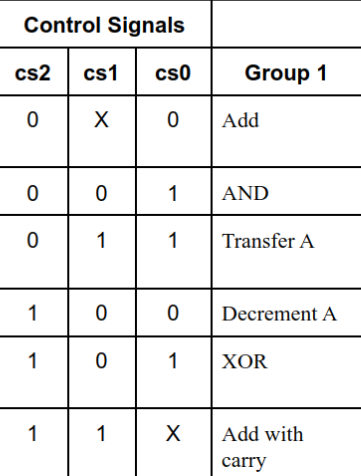
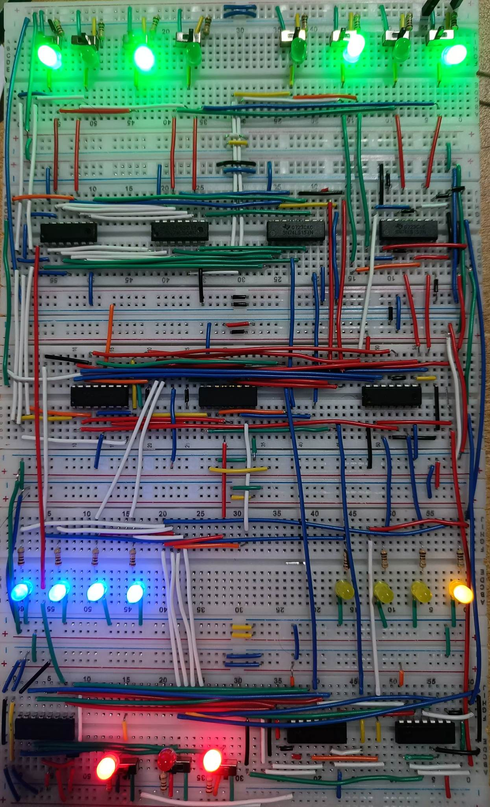

# CSE-306 | Computer Architecture

- ## Project-1 | `4-bit ALU (Arithmetic Logic Unit)`
    - ### [Full Problem Specification](/offline-1/full-problem-spec.pdf)
    - ### [`Logisim design`](/offline-1/logisim-design.circ)

    - ### `Operaton Specification`
        
     

    - ### `Hardware Specification`
        - Bread board - 5
        - IC chip (7400-series) - 10
        - LED - 19
        - Register (1k) - 19 
        - Power supply board - 1
        - Wire 
         
        

